# Visualisation des données — F0_SV0_SP1_t1_D1_R1.mat

Ce dossier contient une série de **11 figures (.jpg)** générées à partir des données du fichier :

> **Fichier source :** `F0_SV0_SP1_t1_D1_R1.mat`

Les figures illustrent différents aspects et résultats extraits du jeu de données, tels que des signaux, spectres, ou autres représentations graphiques pertinentes à l’analyse.

---

## 📊 Figures disponibles

Les figures suivantes sont affichées ci-dessous dans l’ordre numérique :

1. 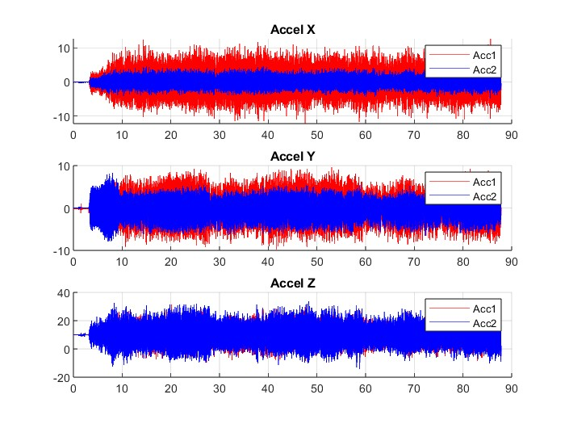
2. 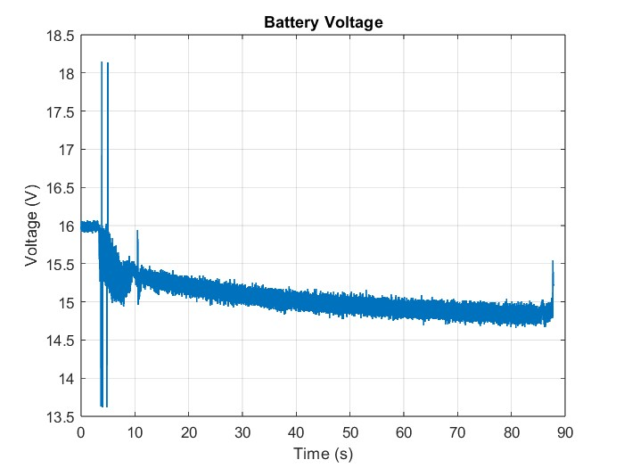
3. 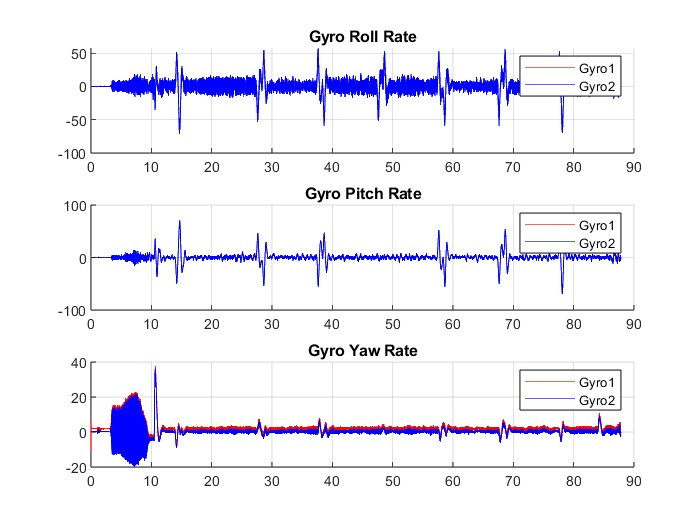
4. 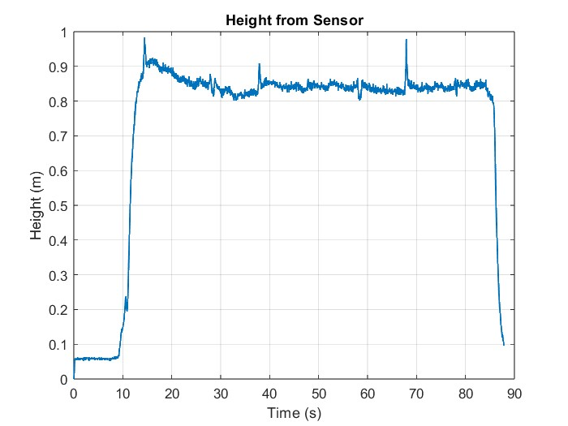
5. 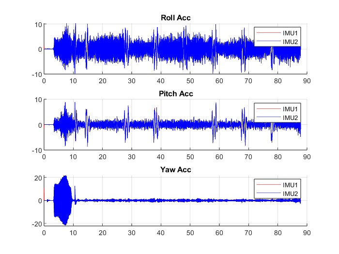
6. 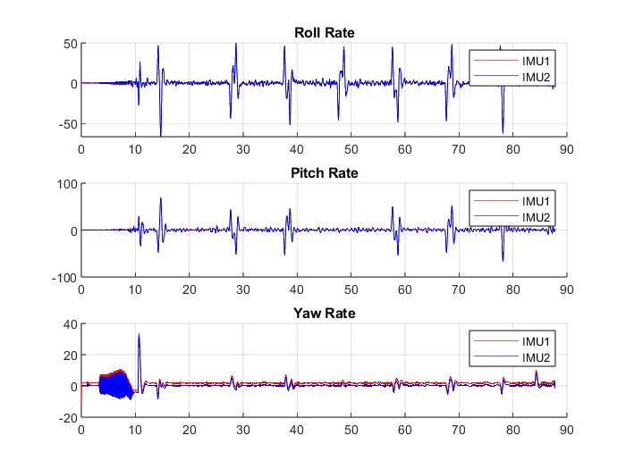
7. 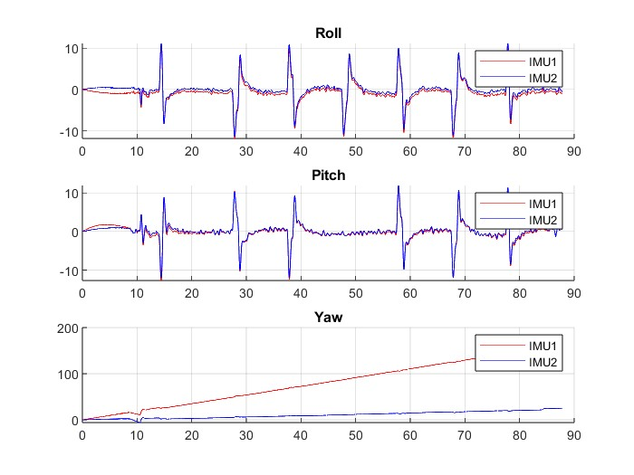
8. 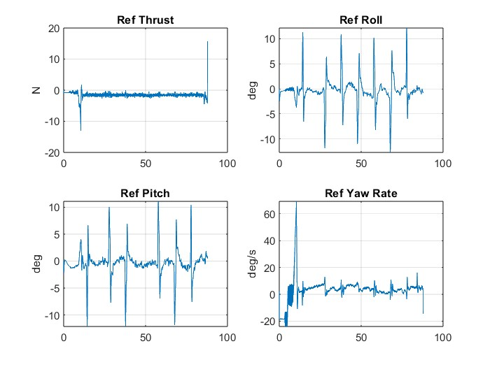
9. 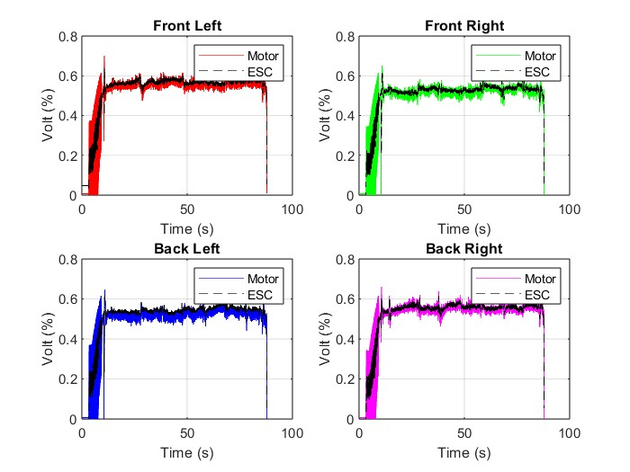
10. 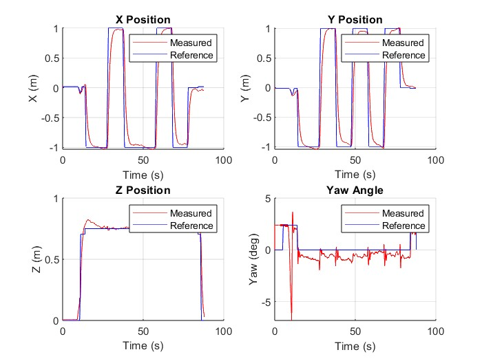
11. 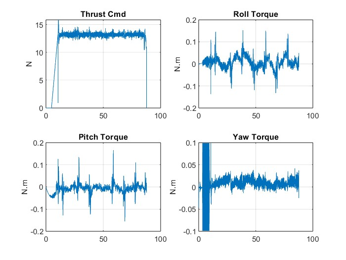

> 💡 Les noms des fichiers `.jpg` doivent correspondre à ceux listés ci-dessus (ex. `figure1.jpg`, `figure2.jpg`, etc.).  
> Si tes fichiers portent d’autres noms, modifie les liens en conséquence.

---

## 🧠 Informations complémentaires

- **Source des données :** fichier MATLAB `F0_SV0_SP1_t1_D1_R1.mat`
- **Format :** structure de données MATLAB contenant les signaux et paramètres d’expérience
- **Traitement :** les figures ont été générées par des scripts d’analyse (non inclus ici)
- **But :** visualiser les résultats et comportements observés à partir du jeu de données

---

## 📁 Organisation du dossier

